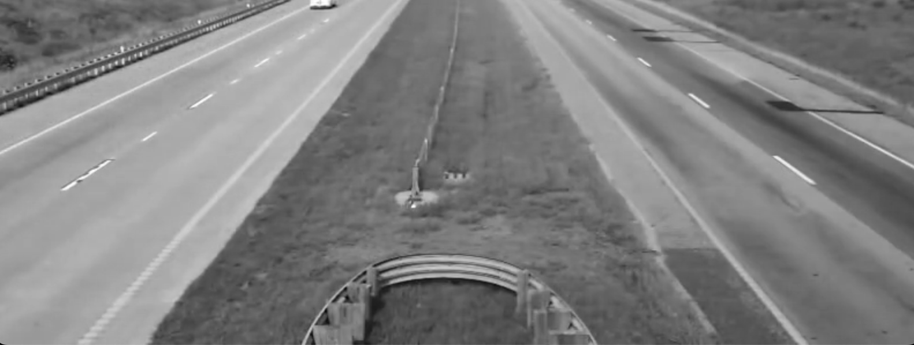
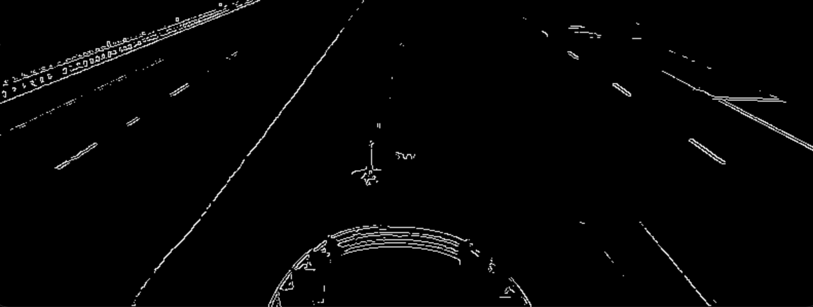
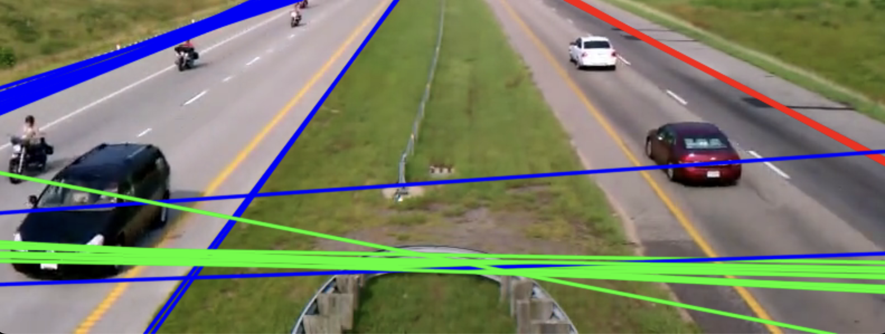
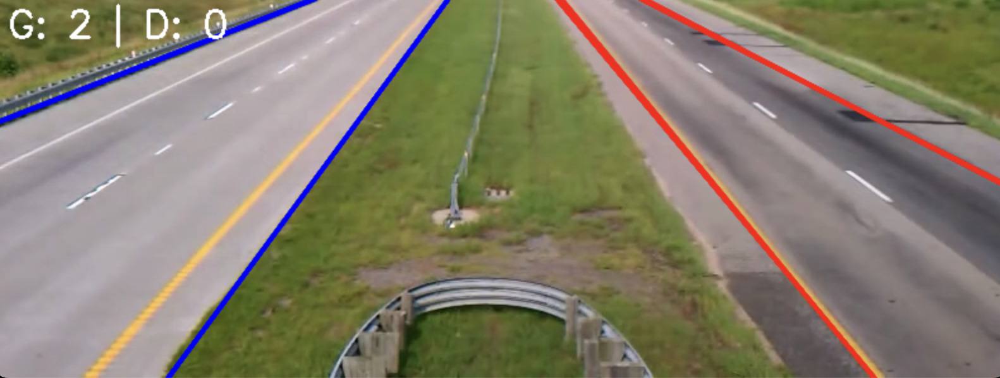
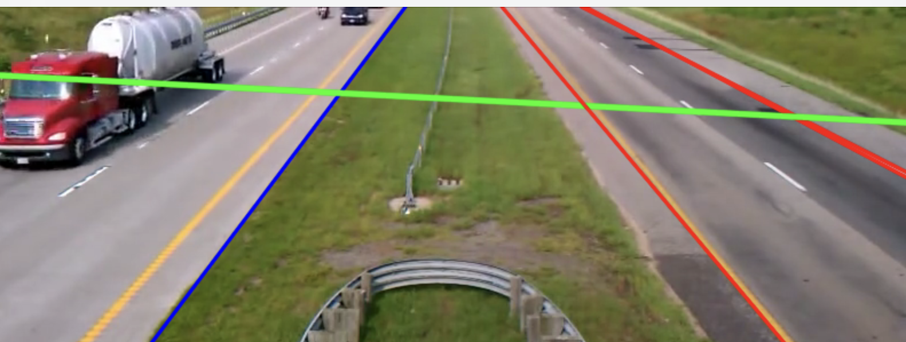
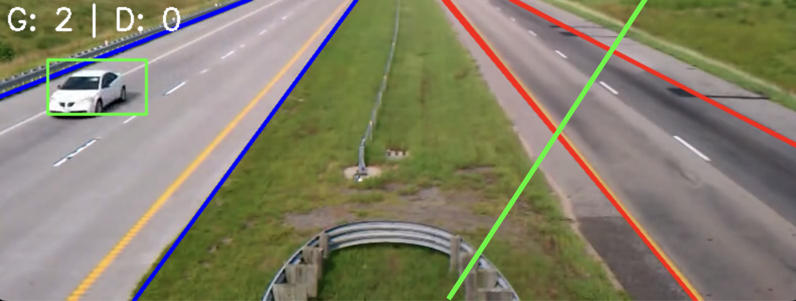
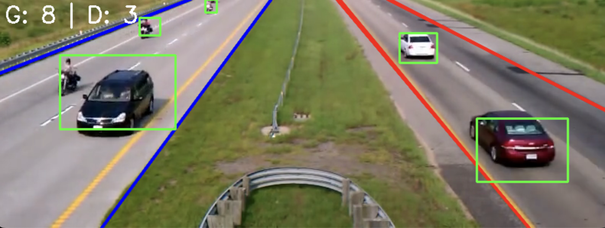

# Compte rendu TP Traitment d'image

## Vasilis SKARLEAS, Rami ARIDI

### Partie 1 - Detection des voies

#### Objectifs

Dans cette premier partie, on souhaite detcter les voies de circulation à gauche et à droit. Ici on travaille sur un video de la roue, mais la meme principe peut etre appliqué aux videos capture par les voitures autonomes pour detceur les voies de gauche et droit respectivement.

On essaye de ne pas se baser sur une maniere de resolution qui est specifique pour cette video, mais d'appliquer des methodes universelles ou on peut appliquer dans differents formats de video tout en incluant des outils qui permettra des reglers les seuils des differents filtres et methodes de traitment d'image qui sont appliqué et qu'on va voir en detail sur le partie ci-dessous (par exemple les Trackbars nous permet de changer les parametres de base de notre application).

#### Methodes / Choix

|                         | Approche 1                                                                                                                                                                                                                    | Approche 1                                                                                                                                                      |
| ----------------------- | ----------------------------------------------------------------------------------------------------------------------------------------------------------------------------------------------------------------------------- | --------------------------------------------------------------------------------------------------------------------------------------------------------------- |
| **Methode**       | Mettre chaque frame sur l'espace HSV et distinguer les voies selon la difference crucial de couleur entre les voies et le verts autour de la route                                                                            | Appliquer la transforme de Hough car les voies sont caracterisé par des lignes droites                                                                         |
| **Avantages**     | Une bone separation entre les voies et la pelouse. C'est une methode simple à mettre en œuvre, car elle ne nécessite pas de transformations mathématiques complexes                                                      | Methode plus universelle car il ne depend pas à la difference des couleurs. C'est une methode robust en ce qui concerne le bruit et la difference d'intensite. |
| **Inconvenients** | Depend sur la difference des couleurs qui est specifique pour les frames en question. En plus, cett emethode est très sensible aux variations d'éclairage, aux ombres et aux autres objets colorés présents dans l'image. | Ce methode ne peut pas etre applique aux cas des voies tournantes si on ne fait pas un raisonenet                                                               |

Dans notre resolution, on a choisi de proceder avec la methode de la ransformation de Hough car elle peut être adaptée à différents types de marquages au sol et à différentes conditions routières. En outre, la transformée de Hough est plus robuste face aux variations d'éclairage et au bruit, quelque chose qui le rendre universelle selon les cas d'application differents.

#### Comment on appliqué ?

La vidéo est constituée d'une série d'images fixes, qui sont affichées les unes après les autres à une vitesse très rapide (30 FPS dans notre cas).

```cpp
Camera::Camera()
{
	m_fps = 30;
}
```

Donc, on peut appliquer tous les differnets ethodes du cours sur chaque image qui compose la video et avoir des resultats en temps reels si on considere la vitesse de la realisation de calcul. [À partir de ce moment, chaque fois qu&#39;on est refercne a une image, en fait on est referene a un frame de la video]().

##### Etapes

1. Obtenir l'image en niveau de gris (`gray`)
   
2. Detection des contours (`edges`)
   
3. Application de la transformée de Hough sur `edges` et sauvegarder les retours de la transformee de Hough sur un vecteur de dimension 2.
   

   1. ρ: qui est a distance par le pixel principale
   2. θ: l'angle de la ligne selon le pixel en question
4. Trier les lignes sauvegardé
5. Fussioner les lignes qui sont tres proches (`rho_tthreshold`) avec une difference d'inclinaison acceptable (`theta_threshold`). Voici une image apres cette procedure:
   

##### Applications

###### Detection des contours

On a besoin de trouver les contours sur l'image car la tranformee de Hough est applicable seulment sur une liste des contours. Forcement pour decter les contours, il faut avoir l'image en noveau de gris. Il y a plusieurs methodes d'obtenir les contours comme l'approche laplacien ou l'approche gradient. Ici, on a procedé avec la methode de Canny qu'on n'a pas vu en cours mais il est sensé d'etre très efficace par rapport le calcul des points de contours.

###### Transformée de Hough

Sur la libraire OpenCV, il a y a deux fonctions qui permet de recuperer les lignes de Hough:

* HoughLines retourne le ρ et le θ
* HoughLinesP retoune les coordonees de deux points qui constiture une ligne

```cpp
cv::HoughLines(edges, lignes, 1, CV_PI / 180, thres_hough);
```

Nous on a utilisé `HoughLines` car on veut faire le trie qu'on va detailer ci-dessous

###### Trier les lignes de Hough

Une fois qu'on a sauvegardé tous les lignes detectes par la tranforme de Hough, il faut distinguer des differents cas et garder que les lignes qui sont en norme. Par exemple, dans l'image ci dessous, la ligne verte ne peut pas etre accepté car l'angle φ est beaucoup plus grand que celui pour les lignes de voies.



Les differents test qu'on effectue sont:

1. Enlever les lignes de Hough qui ont un angle inferieur a thres_hough_theta choisi pendant l'analyse
   ```cpp
   // Tri No 1
   	for (size_t j = 0; j < lignes.size();)
   	{
   		int angle = lignes[j][1] * 180 / CV_PI; // recuperer l'angle en degre car il est donnee en radians par HoughLines()
   		if ((angle > thres_hough_theta) && (angle < 180 - thres_hough_theta))
   		{
   			lignes.erase(lignes.begin() + j); // Enlève l'élément à l'indice j
   		}
   		else // passer à la prochaine
   		{
   			j++;
   		}
   	}
   ```
2. Enlever les lignes restants qui n'ont pas la bonne inclinaison au correct partie de limage.
   
   Dans l'mage ci-dessus, la ligne verte n'est pourait pas accepter meme si il est dans les normes de `thres_hough_theta` car il est localisé à la fausse partie de l'image.
   ```cpp
   // Tri No 2
   	for (size_t i = 0; i < lignes.size() - 1; i++) // ATTENTION: Withouth the -1, there was a segmentation Fault in Macos
   	{

   		float rho = lignes[i][0];
   		float theta = lignes[i][1];
   		double a = cos(theta), b = sin(theta);

   		/* Calcul des coordonnees cartesiennes des points qui compose une ligne.
   		C'est la projection d'un vecteur ligne sur le repere de base */
   		double x0 = a * rho;
   		double y0 = b * rho;

   		/* Calcul du point le plus bas sur la ligne */
   		// Le point (x0, y0) s'agit d'un point le plus proche de l'origine (selon l'équation de Hough).
   		// Le point pt_low est choisi en s'éloignant de ce point le long de la ligne dans une sense (vers le bas dans ce cas là).*/
   		cv::Point pt_low(cvRound(x0 + 1000 * (-b)), cvRound(y0 + 1000 * (a)));

   		/* Corps du tri No 2 */
   		if (pt_low.x > hough_final.cols / 2 && (theta * 180 / CV_PI) < 90) // À droite
   		{
   			lignes.erase(lignes.begin() + i); // On enlève l'élément à l'indice i
   		}
   		else
   		{
   			i++; // On incrémente seulement si on n'a pas effacé l'élément
   		}
   		if (pt_low.x < hough_final.cols / 2 && (theta * 180 / CV_PI) > 90) // À gauche
   		{
   			lignes.erase(lignes.begin() + i); // On enlève l'élément à l'indice i
   		}
   		else
   		{
   			i++;
   		}
   	}
   ```

###### Fussioner les lignes

Si il y a plusiers lignes qui sont très proche (+- rho_threshold) avec une angle similaire (+- theta_threshold), on veut faire un merging et considerer une seule ligne dans ce cas.

```cpp
lignes = merge_lignes(lignes, rho_threshold, theta_threshold); // On merge les lignes

//Voici l'application de l'agorithme de fussion
// Si les lignes de Hough sont tres proches l'un à l'autre, on veut garder que une seule commune pour chaque groupe de lignes
// Remarque 1.2
std::vector<cv::Vec2f> merge_lignes(const std::vector<cv::Vec2f> &lines, float rho_threshold, float theta_threshold)
{
	std::vector<cv::Vec2f> merged_lines;

	std::vector<bool> merged(lines.size(), false);

	for (size_t i = 0; i < lines.size(); ++i)
	{
		if (merged[i])
			continue; // Skip lines that have already been merged

		float rho1 = lines[i][0];
		float theta1 = lines[i][1];

		float rho_sum = rho1;
		float theta_sum = theta1;
		int count = 1;

		// Check for other lines that are close to the current one
		for (size_t j = i + 1; j < lines.size(); ++j)
		{
			float rho2 = lines[j][0];
			float theta2 = lines[j][1];

			// If the lines are close in rho and theta, consider them the same and merge
			if (std::abs(rho1 - rho2) < rho_threshold && std::abs(theta1 - theta2) < theta_threshold)
			{
				rho_sum += rho2;
				theta_sum += theta2;
				count++;
				merged[j] = true; // Mark this line as merged
			}
		}

		// Average the rho and theta values to create the merged line
		float avg_rho = rho_sum / count;
		float avg_theta = theta_sum / count;

		merged_lines.push_back(cv::Vec2f(avg_rho, avg_theta));
	}

	return merged_lines;
}
```

Cette application parcourt les lignes détectées et fusionne celles qui sont proches l'une de l'autre en calculant leur moyenne. Cela permet de réduire le nombre de lignes détectées et d'améliorer la précision de la détection.

##### Ameliorations

Une fois que cette demarche etait mis en complet sur le programe de lecture des images, on voudrait trouver une maniere de isoler le calcul de lignes de transformation de Hough que pour le 10 premiers images, et afficher les lignes final dans le cours de la vidéo. Comme ca, une fois que les camions passent, on n'aura pas une perturbation sur les lignes et par extension avec cette methode, les lignes des voies vont etre stable au cours de la video.

C'est pourquoi sur la logique de la boucle `while(isReading)` il y a un compteur des frames (`frame_id`) pendant laquelle on fait la fussion des lignes. Le vecteur final apres les 10 iterations est toujours affiché via:

```cpp
if (frame_id >= 10)
{
	for (const auto &line : fixed_lines)
	{
		afficher_lignes({line}, frame_with_fixed_lines);
	}
}
```

##### Remarque sur la transformee de Hough

À partir les parametres θ et ρ, on peut calculer des points de la ligne en s'éloignant de point d'origine le long de la ligne dans les deux sens (haut et bas). Avant faire ca, il faut calculer le point d'origine qu'il suffit forcement d'une simple projectiond e la ligne de Hough sur le systeme cartesien x et y via:

```cpp
float rho = lignes[i][0];
float theta = lignes[i][1];

double a = cos(theta);
double b = sin(theta);

/* Calcul des coordonnees cartesiennes des points qui compose une lignes */
double x0 = a * rho;
double y0 = b * rho;
```

Donc pour le calcul de deux points qui permetent de designer la ligne à la fin sur l'image on a:

```cpp
cv::Point pt1(cvRound(x0 + 1000 * (-b)), cvRound(y0 + 1000 * (a)));
cv::Point pt2(cvRound(x0 - 1000 * (-b)), cvRound(y0 - 1000 * (a)));
```

### Partie 2 - Suivi des véhicules

En utilisant les techniques données dans le cours, ici on veut effectuer le suivi des véhicules au cours de la vidéo. La question principale est comment faire car il y a plusiers manieres de proceder ? Ci-dessous on va analyser seulment notre processus de resolution de la problematiqe introduit.

#### Comment on a fait ?

Il faut faire un traitment d'image adapté qui est capable de detecter les objets qui sont en mouvement. La fonction `process_frame(frame_with_fixed_lines, edges, voiture_total_gauche, voiture_total_droite);` va inclure tous les etapes du traitment.

##### Etapes

1. Substraction du frame du maintenant avec le frame precedent. Ca va nous donner une image avec seulment les objets qui sont en mouvement (image `Movement`).
2. Obtenir l'image Movement en niveau de gris
3. Segmentation/binarisation de l'image en utilisant `threshold`
4. On fait une fermeture pour fermer les trous, si possible, à l'image `edges` **qui est l'image Movement binarisé**. On obtiens l'image final `closed`.
5. On trouver les contours via `findContours` pour calculer leurs surface. Comme ça, on peut trier quels contours on veut garder au pas [meme processus pour la plaque d'immatriculation en TD machine]
6. Designer le rectangle autour de voitures
7. On applique l'algorithme de compter les voitures

##### Applications

###### Image *Movement*

Sauvegarder le frame en copie pour realiser la substraction avec le prochaine frame. Comme ça on peut obtenir l'image Movement qui aura seulment les objets qui bougent seulment.

> En C++ et OpenCv, il faut faire un clone() de l'image courant pour etre sur qu'on obtiens pas une reference vers l'image courant mais vraiment un copie de l'image courant. C'est réalisé via `frame_prec = m_frame.clone();`

###### Image Movement en niveau de gris

On utilise le LUT de OpenCV de base qui est COLOR_BGR2GRAY. Voici l'application:

```cpp
/* Obtenir l'image Movement en niveau de grey */
			cv::cvtColor(Movement, gray, cv::COLOR_BGR2GRAY);
```

###### Segmentation de l'image Movement

On utilise aussi la methode predefini chez OpenCV qui est THRESH_BINARY via `cv::threshold(gray, edges, threshold_value, 255, cv::THRESH_BINARY);`

###### Application de la fermeture (erosion -> dilatation)

```cpp
// Appliquer la dilatation
	cv::dilate(edges, dilated, masque);

	// Appliquer l'érosion
	cv::erode(dilated, closed, masque);
```

La masque choici est un rectangle de taille 15x15 qu'on definit à `cv::Mat masque = cv::getStructuringElement(cv::MORPH_RECT, cv::Size(15, 15));`

###### Calcul de la surface de contours & designer les rectangles

La librairie OpenCV viens avec le calcul de la surface de contours via une methode integré (`cv::contourArea(contour)`). En plus, il existe une methode d'obtenir un rectangle approximatif  qui s'appelle `boundingRect`. Pour nous donc il reste de trouver le limit qui nous permet d'accepter ou pas un contour et par extension un rectangle. Donc:

```cpp
for (const auto &contour : contours)
	{
		double area = cv::contourArea(contour); // calcul de la surface du contour

		if (area > 135 && area < 10000)
		{
			// Donner un rectangle approximatif du contour
			cv::Rect boundingBox = cv::boundingRect(contour); // boundingbox: technique par matlab
			voitures_maintenant.push_back(boundingBox);		  // Ajouter le rectangle approximatif à la liste des voitures

			// Afficher le rectangle sur l'image
			cv::rectangle(frame, boundingBox, cv::Scalar(0, 255, 0), 2);
		}
	}
```

Apres plusieurs expirements, on a arrivé sur la condition `area > 135 && area < 10000` . AInsi, si jamias il y a un rectangle approximatif  qui passe le test, alors on va creer un objet rectangle pour le contour en question `boundingBox`.

###### Compter les voitures (algorithme)

1. **Comparaison des rectangles:** Pour chaque nouveau rectangle détecté (voiture actuelle), l'algorithme le compare avec les rectangles détectés précédemment.
2. **Calcul de la distance:** La distance euclidienne entre les centres des rectangles est calculée pour déterminer s'il s'agit du même véhicule.
3. **Classification:** Si le véhicule est considéré comme nouveau (distance supérieure au seuil), il est incrémenté dans le compteur de voitures à gauche ou à droite selon sa position.
4. **Mise à jour:** La liste des voitures précédentes est mise à jour avec la liste des voitures actuelles pour la prochaine itération.

```cpp
// Compter les voitures selon les rectangles approximatifs donnes
void compter_voitures(std::vector<cv::Rect> &voitures_maintenant, int &voitures_gauche, int &voitures_droite, cv::Mat &frame)
{
	const int distance_threshold = 100; // pour la distance entre les centres des rectangles
	const int erreur = 550;				// pour la tolérance de l'erreur sur la voie de gauche ou les voitures viens vers nous et on a un effet de mal comptage quand les rectangles sont places de le debut

	for (const auto &voiture_maintenant : voitures_maintenant)
	{
		bool nouveau = true; // est que c'est nouveau le voiture ?

		for (const auto &voiture_prec : voitures_precedentes)
		{

			// Calcul de la distance euclidiene entre les centres des deux rectangles
			cv::Point centre(voiture_maintenant.x + voiture_maintenant.width / 2, voiture_maintenant.y + voiture_maintenant.height / 2);
			cv::Point centre_prec(voiture_prec.x + voiture_prec.width / 2, voiture_prec.y + voiture_prec.height / 2);

			double distance = cv::norm(centre - centre_prec);

			// If the distance is below the threshold, it's the same car
			if (distance < distance_threshold)
			{
				nouveau = false;
				break; // REALLY IMPORTANT: othwerwise it doesn't stop at the moment that we detected the new car
			}
		}

		// Si c'est vraiment un nouveau voiture, on incremente le compteur global (passe en methode pointeur)
		if (nouveau)
		{
			if ((voiture_maintenant.x) < (frame.cols / 2))
			{
				voitures_gauche++;
			}
			else
			{
				voitures_droite++;
			}
		}
	}

	// Mis a jour de la liste voitures_precedentes avec la liste voitures_maintenant
	voitures_precedentes = voitures_maintenant;
}
```

Le choix des paramètres et la gestion des cas limites sont cruciaux pour l'efficacité de comptage de véhicules. Le seuil de distance, détermine si deux rectangles correspondent au même véhicule. Un seuil trop faible risque de conduire à un double comptage, tandis qu'un seuil trop élevé pourrait entraîner des pertes de véhicules. 

Par ailleurs il faut faire attention à la gestion des cas limites, tels que les véhicules qui sortent du champ de vision ou les erreurs de détection initiales. On a introduit la notion `erreur` pour la tolérance de l'erreur sur la voie de gauche ou les voitures viens vers nous et on a un effet de mal comptage quand les rectangles sont places de le debut. 

Le principe de l'algorithm est la distance euclidiene entre les centres des deux rectangles qu'on compare avec `distance_threshold`. Si c'est vraiment un nouveau voiture, on incremente le compteur global (passe en methode pointeur). Il ne faut pas oublier de mettre à jour la liste `voitures_precedentes` avec la liste `voitures_maintenant`. C'est la liste avec les rectangles, donc ca veut dire les objets en mouvement qui sont détectés.

Voici un exemple d'application des differents etapes:



##### Pour aller plus loin...

Si jamais on est interesé de garder que une seule ligne pour la voie gauche et une seule ligne pour la ligne droite, on peut appliquer une methode de moyenne entre les deux lignes principaux de la voie. Voici la logique de la fonction `std::vector<cv::Vec2f> keep_one_line(std::vector<cv::Vec2f> &lignes)`.

```cpp
std::vector<cv::Vec2f> keep_one_line(std::vector<cv::Vec2f> &lignes)
{
	std::vector<cv::Vec2f> one_line;
	float rho_moyenne_gauche = 0;
	float theta_moyen_gauche = 0;
	float rho_moyenne_droite = 0;
	float theta_moyen_droite = 0;

	int nombre_droite = 0; // nombre de droite a droite
	int nombre_gauche = 0; // nombre de droite a gauche

	/* On va parcourir tous les lignes */
	for (size_t i = 0; i < lignes.size(); i++)
	{
		/* Obtenir les coordonees polaires de la ligne */
		float rho = lignes[i][0];
		float theta = lignes[i][1];

		/* Decision si la ligne est plus proche à gauche ou plus proche à droit selon theta et rho */
		if (rho < 0 && theta > CV_PI / 2) // est qu'on à gauche ? Si oui, alors theta est superieur que pi/2
		{
			rho_moyenne_gauche += rho;
			theta_moyen_gauche += theta;
			nombre_gauche++;
		}
		else if (rho > 0 && theta < CV_PI / 2) // on à droite? Si oui, alors theta est inferieur que pi/2
		{
			rho_moyenne_droite += rho;
			theta_moyen_droite += theta;
			nombre_droite++;
		}
	}

	rho_moyenne_gauche = rho_moyenne_gauche / nombre_gauche;
	theta_moyen_gauche = theta_moyen_gauche / nombre_gauche;

	rho_moyenne_droite = rho_moyenne_droite / nombre_droite;
	theta_moyen_droite = theta_moyen_droite / nombre_droite;

	// Ajouter deux éléments au vecteur
	one_line.push_back(cv::Vec2f(rho_moyenne_droite, theta_moyen_droite)); // Premier élément
	one_line.push_back(cv::Vec2f(rho_moyenne_gauche, theta_moyen_gauche)); // Deuxième élément

	return one_line; //il a une ligne pour la voie gauche et 
}
```
